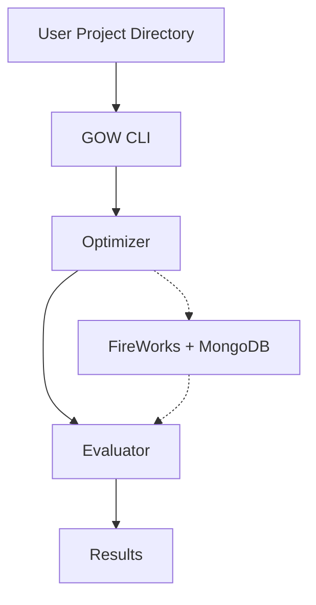
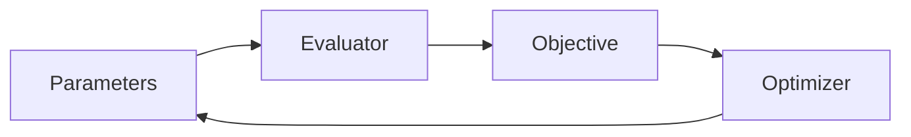

# Generic Optimization Workflow (GOW)
## User & Reference Manual

This document is the **authoritative user-facing documentation** for the Generic Optimization Workflow (GOW).
It reflects the **current, working codebase and CLI**

---

## 1. Overview

### 1.1 Purpose

The **Generic Optimization Workflow (GOW)** is a lightweight, problem-agnostic framework for running numerical
optimization campaigns over **black-box evaluators**.

GOW provides:
- orchestration of optimization loops,
- structured evaluation of candidates,
- robust and reproducible result storage,
- optional distributed execution using FireWorks and MongoDB.

GOW deliberately does **not** implement domain logic or solvers. Evaluators are external programs or scripts
supplied by the user.

---

### 1.2 Philosophy

- **Framework, not project runner** – optimization projects live outside the GOW repository  
- **Declarative configuration** – problems are described via YAML or JSON  
- **Black-box evaluators** – GOW does not introspect user code  
- **Identical semantics locally and distributed** – same layout, same results  

---

## 2. Architecture



---

## 3. Installation

### 3.1 Requirements

- Python **3.10+**
- pip
- Git

Optional:
- MongoDB (for FireWorks execution)
- FireWorks

---

### 3.2 Installation (Linux / macOS)

```bash
git clone <repository-url>
cd generic-optimization-workflow
python -m venv .venv
source .venv/bin/activate
pip install -e .
```

Optional FireWorks support:

```bash
pip install -e ".[fireworks]"
```

---

### 3.3 Installation (Windows)

```powershell
git clone <repository-url>
cd generic-optimization-workflow
python -m venv .venv
.venv\Scripts\Activate.ps1
pip install -e .
```

Optional FireWorks support:

```powershell
pip install -e ".[fireworks]"
```

---

## 4. Recommended Project Layout

Each optimization project lives **outside** the GOW repository.

```
my-optimization-project/
├── problem.yaml
└── results/
```

- `problem.yaml`: optimization problem definition
- `results/`: automatically generated artifacts

---

## 5. Problem Configuration (`problem.yaml`)

### 5.1 Conceptual Model

A GOW optimization problem consists of:

1. **Problem identity**
2. **Parameters** (optimizable and fixed)
3. **Objective**
4. **Evaluator**
5. **Optimizer configuration**
6. **Optional context metadata**



---

### 5.2 Problem Identity

```yaml
id: toy-sphere
```

- Filesystem-friendly, stable identifier
- Used to name `results/<problem_id>/`

Best practices:
- lowercase
- hyphen-separated
- stable across runs

---

### 5.3 Parameters

Parameters define all values passed to the evaluator.

Two categories:
- **Optimizable parameters** (decision variables)
- **Fixed / runtime parameters** (constants)

Common fields:
- `type`: `real`, `int`, `bool`, `str` / `categorical`
- `value`: default or fixed value
- `bounds` or `choices`: search space
- `optimizable`: true / false (optional)
- optional metadata (`description`, `units`, etc.)

#### Continuous parameter

```yaml
x:
  type: real
  value: 0.1
  bounds: [-5.0, 5.0]
```

#### Integer parameter

```yaml
n:
  type: int
  value: 5
  bounds: [1, 10]
  optimizable: false
```

#### Categorical parameter

```yaml
mode:
  type: categorical
  value: a
  choices: [a, b, c]
```

#### Boolean parameter

```yaml
use_cache:
  type: bool
  value: true
```

All parameters (optimized or not) are written to `input.json` and recorded in results.

---

### 5.4 Objective

The objective defines:
- optimization direction (`minimize` or `maximize`)
- a single scalar fitness value

Evaluators may compute many metrics, but only one objective is used for ranking.

---

### 5.5 Evaluator

The evaluator defines **how a candidate is evaluated**.

Typical contract:
1. GOW creates a candidate work directory
2. Writes `input.json`
3. Executes the evaluator command
4. Reads machine-readable output (e.g. `output.json`)
5. Records status, objective, metrics

Example:

```yaml
evaluator:
  command: ["{python}", "../../tests/toy_eval.py"]
  timeout_s: 60
  env:
    OMP_NUM_THREADS: "1"
```

Key features:
- command is a list (cross-platform)
- `{python}` resolves to the active interpreter
- optional timeout protection
- optional environment variables

Each candidate directory contains:
- `input.json`
- `output.json`
- `stdout.txt`
- `stderr.txt`
- `result.json`

---

### 5.6 Failures, Constraints, and Metrics

If evaluation fails:
- status should be `failed`
- objective may be null
- error message should be provided

Constraints are typically enforced inside the evaluator:
- hard failure
- penalty-based objective
- or separate constraint metrics

Multiple metrics can be stored for analysis even if only one objective is optimized.

---

### 5.7 Optimizer Configuration

Typical fields:
- `name`
- `seed`
- `max_evaluations`
- `batch_size`

Batch size controls:
- grouping of evaluations locally
- submission granularity with FireWorks

---

### 5.8 Context Metadata (Optional)

```yaml
context:
  note: toy example
  author: user
```

Context is arbitrary metadata:
- not optimized
- passed through for traceability
- stored with results

---

## 6. Toy Example (Self-Contained)

```yaml
id: toy-sphere

objective:
  direction: minimize

parameters:
  x:
    type: real
    value: 0.1
    bounds: [-5.0, 5.0]

  y:
    type: real
    value: -0.2
    bounds: [-5.0, 5.0]

evaluator:
  command: ["{python}", "../../tests/toy_eval.py"]
  timeout_s: 60

optimizer:
  name: random_search
  seed: 123
  max_evaluations: 20
  batch_size: 4

context:
  note: toy example
```

---

## 7. Running Locally

```bash
gow run problem.yaml
```

Produces:

```
results/
  toy-sphere/
    results.jsonl
    summary.json
    runs/
      <run_id>/
        results.jsonl
        summary.json
        c000000/
        ...
```

---

## 8. Single-Candidate Evaluation

```bash
gow evaluate problem.yaml   --run-id debug   -p x=0.2 -p y=0.4
```

Useful for debugging evaluators and parameter mappings.

---

## 9. Inspecting Results

```bash
gow best results/toy-sphere/runs/<run_id>
```

---

## 10. Distributed Execution with FireWorks

```bash
gow fw run problem.yaml --launchpad my_launchpad.yaml
rlaunch rapidfire
```

FireWorks:
- provides parallelism and fault tolerance
- uses MongoDB-backed task queue
- preserves the same results layout

---

## 11. Environment Variables

Override results directory:

```bash
export GOW_OUTDIR=/path/to/results
```

Windows:

```powershell
$env:GOW_OUTDIR="D:\results"
```

---

## 12. Recommended User Workflow

1. Create project directory
2. Write `problem.yaml`
3. Validate with `gow evaluate`
4. Run locally with `gow run`
5. Scale with `gow fw run`

---

## 13. Summary

The Generic Optimization Workflow provides a clean, extensible, and reproducible framework
for optimization problems, from toy examples to large distributed campaigns, without
changing user-facing semantics.